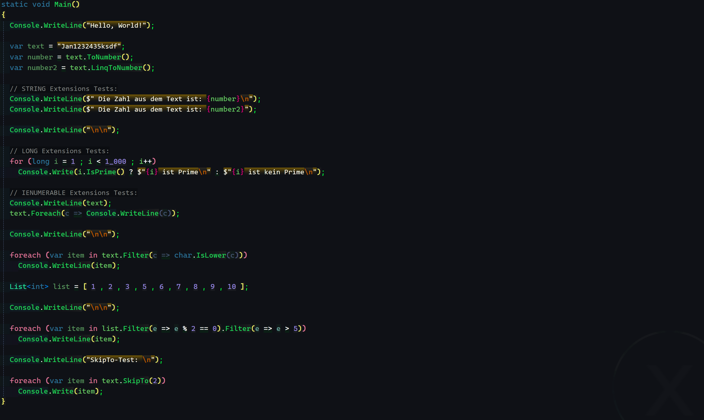
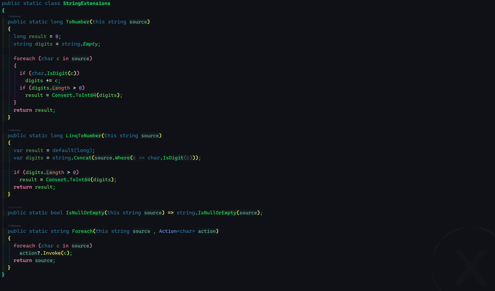
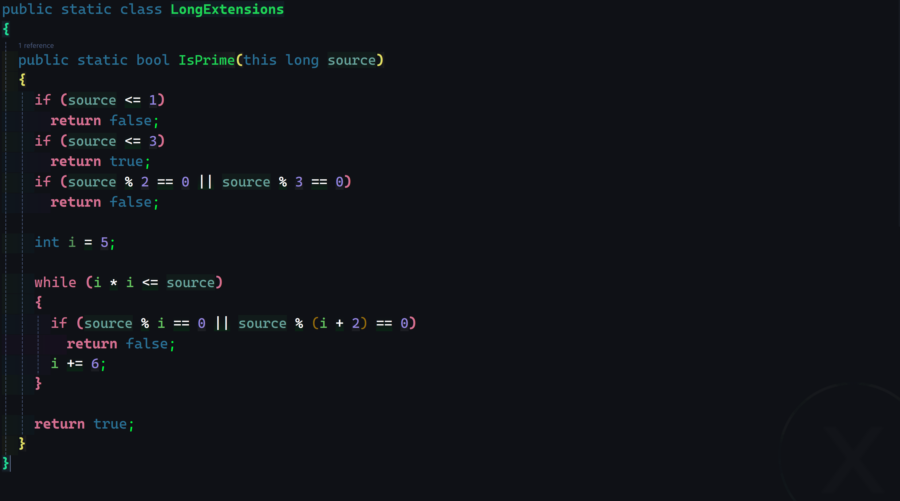
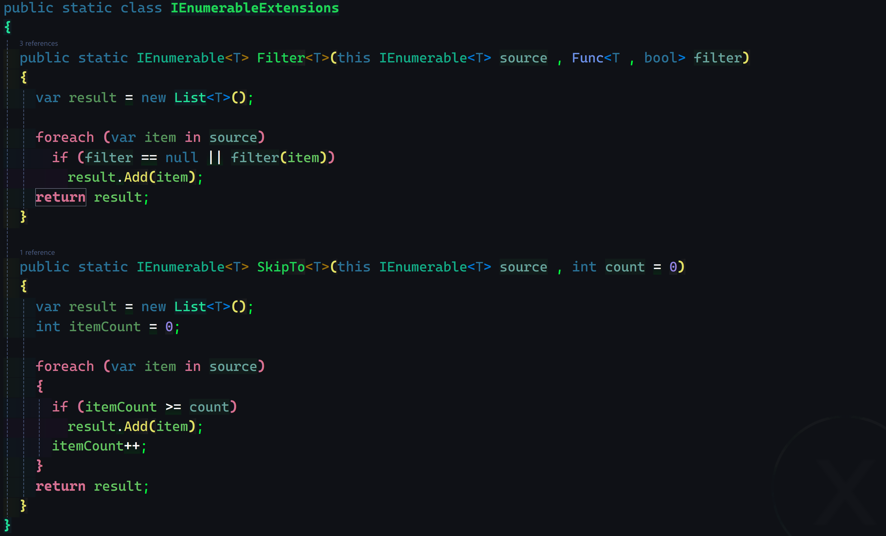

###### <p align="center"> PoseUebung-011 -- Extensions Demo </p> 

- ## 0.) Test ConsoleApp:

<div align="center">
  
</div>

---
- ## 1.) String Extensions

<div align="center">
  
</div>

<details>
  
  <summary> code to copy </summary>

  ```c#
  public static class StringExtensions
  {
    public static long ToNumber(this string source)
    {
      long result = 0;
      string digits = string.Empty;

      foreach (char c in source)
      {
        if (char.IsDigit(c))
          digits += c;

        if (digits.Length > 0)
          result = Convert.ToInt64(digits);
      }
      return result;
    }

    public static long LinqToNumber(this string source)
    {
      var result = default(long);
      var digits = string.Concat(source.Where(c => char.IsDigit(c)));

      if (digits.Length > 0)
        result = Convert.ToInt64(digits);

      return result;
    }

    public static bool IsNullOrEmpty(this string source) => string.IsNullOrEmpty(source);

    public static string Foreach(this string source , Action<char> action)
    {
      foreach (char c in source)
        action?.Invoke(c);

      return source;
    }
  }
  ```

</details>

---
- ## 2.) Long Extensions  

<div align="center">
  
</div>

<details>
  
  <summary> code to copy </summary>

  ```c#
  public static class LongExtensions
  {
    public static bool IsPrime(this long source)
    {
      var result = true;

      if (source <= 1 || source % 2 == 0 || source % 3 == 0)
        result = false;

      else if (source <= 3 || source == 2)
        result = true;

      else
      {
        int i = 5;

        while (i * i <= source && !result)
        {
          if (source % i == 0 || source % (i + 2) == 0)
            result = false;

          i += 6;
        }
        result = true;
      }
      return result;
    }
  }
  ```
</details>

---
- ## 3.) IEnumerable Extensions  

<div align="center">
  
</div>

<details>
  
  <summary> code to copy </summary>

  ```c#
  public static class IEnumerableExtensions
  {
    public static IEnumerable<T> Filter<T>(this IEnumerable<T> source , Func<T , bool> filter)
    {
      var result = new List<T>();

      foreach (var item in source)
        if (filter == null || filter(item))
          result.Add(item);

      return result;
    }

    public static IEnumerable<T> SkipTo<T>(this IEnumerable<T> source , int count = 0)
    {
      var result = new List<T>();
      int itemCount = 0;

      foreach (var item in source)
      {
        if (itemCount >= count)
          result.Add(item);

        itemCount++;
      }
      return result;
    }
  }
  ```
</details>
